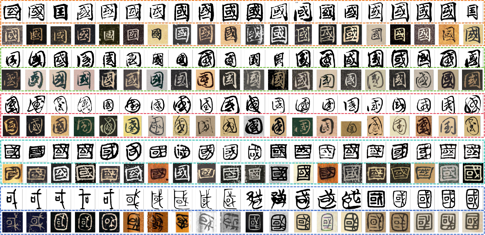

# 🏛️ HUNet: Hierarchical Universal Network for Multi-Type Ancient Chinese Character Recognition

> 📜 **Evolution Note**: Previously known as `FLENet`

<div align="center">

✨ **HUNet** (Current Version) → ✨ **FLENet** (Legacy Version)  

[](https://opensource.org/licenses/MIT)
</div>

## 🌟 Key Features and Core Concepts

<div align="center">
  
</div>

### 🚀 Core Advantages
| Feature | Description | Emoji |
|---------|-------------|-------|
| **Fast** | Optimized for high-speed recognition | ⚡ |
| **Lean** | Minimal resource consumption | 🌿 |
| **Efficient** | State-of-the-art accuracy | 🛠️ |

### 🔍 Key Components
|  | Feature | Description |
|--|---------|-------------|
| 🏗️ | **Hierarchical Structure** | Multi-level recognition for diverse ancient scripts |
| 🌐 | **Universal Model** | Single model handles multiple character types |
| 🧠 | **Advanced Architecture** | Innovative deep learning techniques |

## 📂 Dataset Preparation


### 🗂 Directory Structure

```
datasets/
├── train/                      # Training set
│   ├── 篆书/                   # Seal script
│   │   ├── 爱/                 # Character "爱"  
│   │   │   ├── 1.jpg           # Sample image
│   │   │   ├── 2.jpg
│   │   │   └── ...             # Other samples
│   │   ├── 书/                 # Other characters
│   │   └── ...                 
│   │
│   ├── 隶书/                   # Clerical script
│   │   ├── 爱/
│   │   │   ├── 1.jpg
│   │   │   └── ...
│   │   └── ...                 
│   │
│   └── ...                     # Other script types
│
└── test/                       # Test set
    ├── test_1/                 # Test set 1
    │   ├── 爱/
    │   │   ├── 1.jpg
    │   │   └── ...
    │   └── ...                 
    │
    └── test_2/                 # Test set 2
        ├── 爱/
        │   ├── 1.jpg
        │   └── ...
        └── ...
```


### 📸 Sample Images

<div style="text-align: center; margin: 20px 0;">
    
</div>


## 🚀 Model Training

```bash
python train.py \
    --img_size "m" \
    --num_classes 8105 \
    --epochs 20 \
    --batch-size 256 \
    --lr 0.001 \
    --data-path "./datasets" \
    --checkpoint "./experiments/best_val_checkpoint/"
```

## ⚙️ Training Parameters

| Parameter        | Type  | Default                          | Options               | Description                          |
|------------------|-------|----------------------------------|-----------------------|--------------------------------------|
| `--img_size`     | str   | "m"                              | ['s', 'm', 'l', 'n']  | Input image size specification       |
| `--num_classes`  | int   | 8105                             | -                     | Total number of character classes    |
| `--epochs`       | int   | 20                               | -                     | Total training epochs               |
| `--batch-size`   | int   | 256                              | -                     | Number of samples per training batch |
| `--lr`           | float | 0.001                            | -                     | Initial learning rate               |
| `--data-path`    | str   | './datasets'                     | -                     | Root path of training dataset       |
| `--weights`      | str   | "" (empty string)                | -                     | Path to pretrained weights          |
| `--checkpoint`   | str   | "./experiments/best_val_checkpoint/" | -              | Path to save model checkpoints      |
| `--freeze-layers`| flag  | False                            | -                     | Whether to freeze partial network layers |
| `--device`       | str   | 'cuda'                           | ['cuda', 'cpu']       | Training device selection           |


## 🔍 Inference (ONNX Runtime)

```bash
python test.py
```

> 💡 ​​Prerequisite​​: Install ONNX Runtime
```bash
pip install onnxruntime
```

📥 Download ONNX Model：[link](https://pan.baidu.com/s/128r532vfGq4XkxrJoaKb3w?pwd=59u8)


## 💾 Checkpoints

best_val_checkpoint 下载：[link](https://pan.baidu.com/s/1SPgGAD6snK1vWuFlD3EZXA?pwd=tmdp)

🏷️ Checkpoint Structure
```python
checkpoint = {
    'epoch': epoch,
    'model_state_dict': model.state_dict(),
    'optimizer_state_dict': optimizer.state_dict(),
    'scheduler_state_dict': scheduler.state_dict(),
    'best_metric': val_acc,
    'model_name': model_name,
}
```

### Checkpoint Structure Explanation:
| Key | Description |
|-----|-------------|
| `epoch` | Current training epoch number |
| `model_state_dict` | Model's parameter dictionary |
| `optimizer_state_dict` | Optimizer's state dictionary |
| `scheduler_state_dict` | Learning rate scheduler's state |
| `best_metric` | Best validation accuracy achieved |
| `model_name` | Name/identifier of the model |

### 💻 Usage Example
```python
# Save checkpoint
torch.save(checkpoint, 'model_checkpoint.pth')

# Load checkpoint
checkpoint = torch.load('model_checkpoint.pth')
model.load_state_dict(checkpoint['model_state_dict'])
optimizer.load_state_dict(checkpoint['optimizer_state_dict'])
```

## 📱 Demo Application

<div style="display: flex; justify-content: center; align-items: center; margin: 20px 0; overflow-x: auto;">
    <div style="display: inline-flex; align-items: center; min-width: fit-content;">
        <!-- 缩小后的第一张图（250px） -->
        <div style="display: flex; align-items: center; justify-content: center; height: 300px;">
            
        </div>
        <!-- 原始尺寸的第二张图（300px） -->
        <div style="display: flex; align-items: center; justify-content: center; height: 300px;">
            
        </div>
    </div>
</div>

### 🙏 Acknowledgments

We would like to express our gratitude to the following projects and resources :

- [AncientGlyphNet](https://github.com/youngbbi/AncientGlyphNet) : an advanced deep learning framework for detecting ancient Chinese characters in complex scene.


## 📜 Citation

If you find this work useful, please consider citing:

```bibtex
@article{wang2025hunet,
  title={HUNet: Hierarchical Universal Network for Multi-Type Ancient Chinese Character Recognition},
  author={Wang, Zhaojiang and Zhang, Chu and Lang, Qing and Jin, Lianwen and Qi, Hengnian},
  journal={npj Heritage Science},
  volume={13},
  number={1},
  pages={1--16},
  year={2025},
  publisher={Nature Publishing Group}
}
```

<div align="center" style="margin-top: 40px;"> <p style="color: #666; font-size: 1.1em; font-style: italic;"> <i class="fas fa-monument" style="color: #8B4513;"></i> Preserving Cultural Heritage Through AI <i class="fas fa-robot" style="color: #4B9CD3;"></i> </p> </div> 