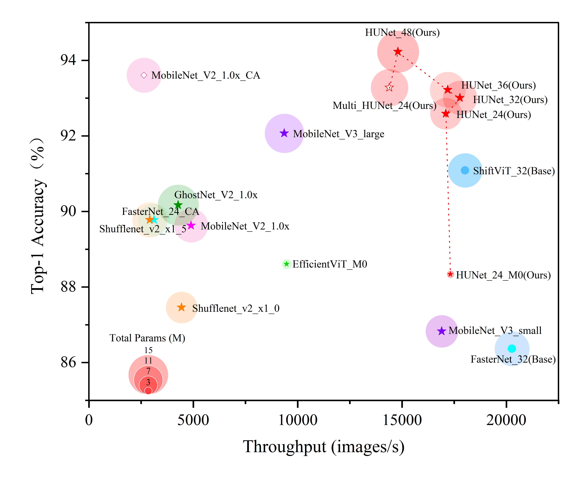

# HUNet: Hierarchical Universal Network for Multi-Type Ancient Chinese Character Recognition

[](https://opensource.org/licenses/MIT)

## 1. 性能对比

<div style="text-align: center; margin: 20px 0;">
    
</div>


## 2. 数据准备


### 数据集目录结构

```
datasets/
├── train/                      # 训练集目录
│   ├── 篆书/                   # 篆书字体类别
│   │   ├── 爱/                 # 字符"爱"的子目录  
│   │   │   ├── 1.jpg           # 样本图像
│   │   │   ├── 2.jpg
│   │   │   └── ...             # 其他样本
│   │   ├── 书/                 # 其他字符目录
│   │   └── ...                 # 其他字符
│   │
│   ├── 隶书/                   # 隶书字体类别
│   │   ├── 爱/
│   │   │   ├── 1.jpg
│   │   │   └── ...
│   │   └── ...                 
│   │
│   └── ...                     # 其他字体类别（楷书/行书等）
│
└── test/                       # 测试集目录
    ├── test_1/                 # 测试集1
    │   ├── 爱/
    │   │   ├── 1.jpg
    │   │   └── ...
    │   └── ...                 # 其他测试字符
    │
    └── test_2/                 # 测试集2
        ├── 爱/
        │   ├── 1.jpg
        │   └── ...
        └── ...
```

### 数据样本

<div style="text-align: center; margin: 20px 0;">
    
</div>

## 3. HUNet模型训练

```bash
python train.py
```

## 参数列表

| 参数名称 | 类型 | 默认值 | 可选值 | 描述 |
|---------|------|--------|--------|------|
| `--img_size` | str | "m" | ['s', 'm', 'l', 'n'] | 输入图像尺寸规格 |
| `--num_classes` | int | 8105 | - | 识别字符总数 |
| `--epochs` | int | 20 | - | 训练总轮数 |
| `--batch-size` | int | 256 | - | 每批次训练样本数 |
| `--lr` | float | 0.001 | - | 初始学习率 |
| `--data-path` | str | './datasets' | - | 训练数据集根路径 |
| `--datasets_count` | flag | True | - | 是否显示数据集统计信息 |
| `--weights` | str | "" | - | 预训练权重路径 |
| `--checkpoint` | str | "./experiments/best_val_checkpoint/" | - | 模型检查点保存路径 |
| `--freeze-layers` | flag | False | - | 是否冻结部分网络层 |
| `--device` | str | 'cuda' | ['cuda', 'cpu'] | 训练设备选择 |


## 4. HUNet模型推理（ONNX）

```bash
python test.py
```

> 注：需提前安装onnxruntime
```bash
pip install onnxruntime
```

ONNX 模型下载：[link](https://pan.baidu.com/s/128r532vfGq4XkxrJoaKb3w?pwd=59u8)


## 5. Checkpoints

best_val_checkpoint 下载：[link](https://pan.baidu.com/s/1SPgGAD6snK1vWuFlD3EZXA?pwd=tmdp)

```python
checkpoint = {
    'epoch': epoch,
    'model_state_dict': model.state_dict(),
    'optimizer_state_dict': optimizer.state_dict(),
    'scheduler_state_dict': scheduler.state_dict(),
    'best_metric': val_acc,
    'model_name': model_name,
}
```

### Checkpoint Structure Explanation:
| Key | Description |
|-----|-------------|
| `epoch` | Current training epoch number |
| `model_state_dict` | Model's parameter dictionary |
| `optimizer_state_dict` | Optimizer's state dictionary |
| `scheduler_state_dict` | Learning rate scheduler's state |
| `best_metric` | Best validation accuracy achieved |
| `model_name` | Name/identifier of the model |

### Usage Example:
```python
# Save checkpoint
torch.save(checkpoint, 'model_checkpoint.pth')

# Load checkpoint
checkpoint = torch.load('model_checkpoint.pth')
model.load_state_dict(checkpoint['model_state_dict'])
optimizer.load_state_dict(checkpoint['optimizer_state_dict'])
```