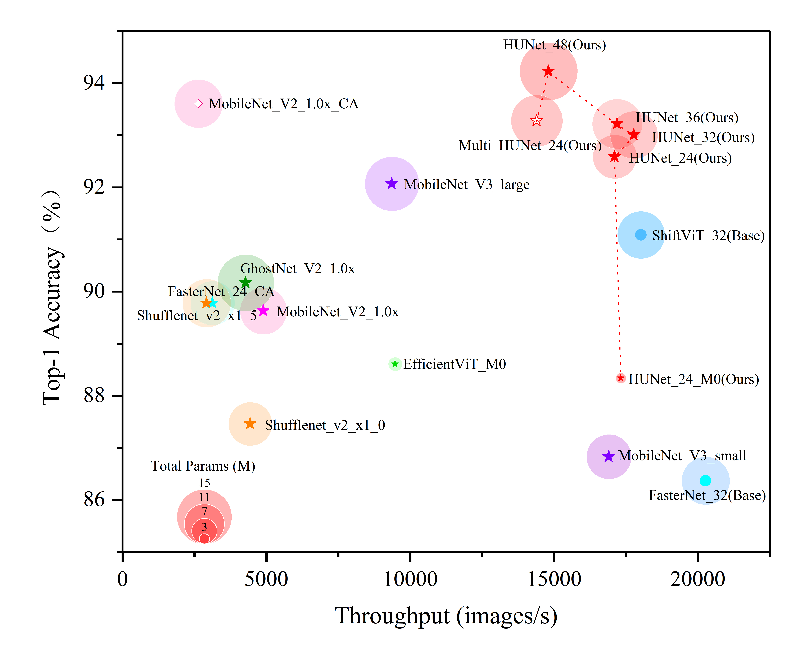

# HUNet: An Efficient Multi-Stage Feature Extraction Network for Recognizing Multiple Chinese Characters

## Performance Comparison of HUNet with Other Efficient CNNs and ViTs on the 8TCC Test_1 Set

| Model                                 | Top-1 (%) | Params (M)      | Feature_dim | Total depths       | Throughput (images/s) |               |               |               |
|---------------------------------------|-----------|-----------------|-------------|--------------------|-----------------------|---------------|---------------|---------------|
|                                       |           |                 |             |                    | GPU                   | CPU           | ONNX          |
| ShiftViT_32(Base) [76]               | 91.09     | 12.81 (2.43)    | 1280        | 12 (2,2,6,2)        | 18022                 | 47.1          | 42.2          |
| FasterNet_32(Base) [71]              | 86.37     | 12.95 (2.56)    | 1280        | 12 (2,2,6,2)        | 20268                 | 51.6          | 141.8         |
| FasterNet_24_CA [71]                 | 89.78     | 11.92 (1.54)    | 1280        | 12 (2,2,6,2)        | 3124                  | 20.7          | ----          |
| MobileNet_V2_1.0x [30]               | 89.63     | 12.61 (2.22)    | 1280        | 11                 | 4893                  | 30            | 93.7          |
| MobileNet_V2_1.0x_CA [30]            | 93.61     | 13.05 (2.67)    | 1280        | 11                 | 2638                  | 21.8          | ----          |
| MobileNet_V3_small [31]              | 86.83     | 12.05 (1.67)    | 1280        | 11                 | 16904                 | 111.8         | 322.6         |
| MobileNet_V3_large [31]              | 92.07     | 14.59 (4.20)    | 1280        | 15                 | 9361                  | 46.5          | 90.8          |
| GhostNet_V2_1.0x [35]                | 90.17     | 15.26 (4.88)    | 1280        | 16                 | 4279                  | 27.2          | 80.1          |
| EfficientViT_M0 [47]                 | 88.61     | 3.72 (2.16)     | 192         | 6 (1,2,3)           | 9471                  | 49.2          | 330.3         |
| ShufHUNet_v2_x1_0 [33]              | 87.46     | 11.75 (1.38)    | 1280        | 16                 | 4434                  | 63.7          | 249           |
| ShufHUNet_v2_x1_5 [33]              | 89.78     | 13.04 (2.66)    | 1280        | 16                 | 2917                  | 55            | 158.5         |
| HUNet_24_M0(Ours)                   | 88.34     | 2.75 (1.19)     | 192 (24×8)  | 12 (2,2,6,2)        | 17318                 | 64.9          | 117.7         |
| HUNet_24(Ours)                      | 92.59     | 11.82 (1.43)    | 1280        | 12 (2,2,6,2)        | 17103                 | 50.8          | 108.1         |
| HUNet_32(Ours)                      | 93.01     | 12.82 (2.43)    | 1280        | 12 (2,2,6,2)        | 17777                 | 39.1          | 81.4          |
| HUNet_36(Ours)                      | 93.22     | 13.42 (3.03)    | 1280        | 12 (2,2,6,2)        | 17192                 | 40.2          | 73.6          |
| HUNet_48(Ours)                      | 94.23     | 15.60 (5.22)    | 1280        | 12 (2,2,6,2)        | 14806                 | 32.7          | 53.9          |
| Multi_HUNet_24(Ours)                | 93.28     | 13.89 (3.51)    | 1280        | 12 (2,2,6,2)        | 14395                 | 43.6          | ----          |

**Note**: GPU Throughput and CPU Throughput are tested on the Nvidia RTX 3090 GPU and the Intel(R) Core(TM) i9-10900K CPU @ 3.70GHz CPU, respectively. A higher Throughput indicates faster inference speed. The values in parentheses for Params represent the parameter size of the backbone network, and the numbers in the model names correspond to the number of channels (C) in the initial embedded feature maps.
